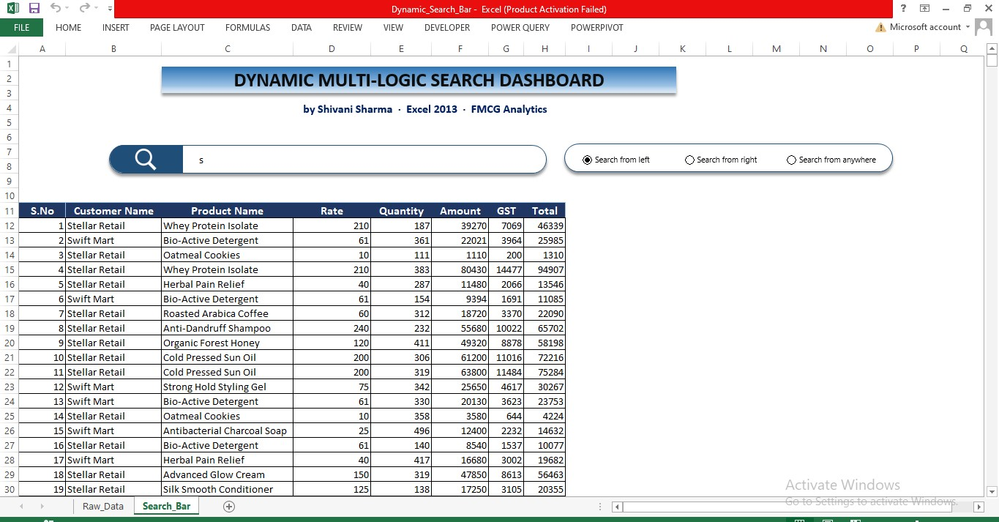
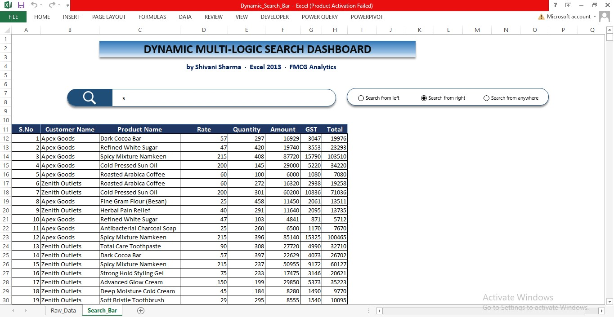

# Dynamic Multi-Logic Search Dashboard
## Excel 2013 | No VBA | No Macros | FMCG-Ready

> A production-grade, formula-only search engine built inside
> Excel 2013 — featuring three intelligent search modes,
> dynamic row indexing, and a clean radio-button UI.
> Designed for high-volume FMCG distributors.

**Author:** Shivani Sharma  
**Tools:** Excel 2013, VLOOKUP, CHOOSE, LEFT, RIGHT, SEARCH, MAX  
**Use Case:** FMCG · Wholesale · Retail · Pharma Distribution
## 📸 Dashboard Preview

### Raw Data (500+ Records)

### Search Bar — Live Demo
(screenshots/Search_from_left.jpg)

### Search Bar — Live Demo

### Search Bar — Live Demo

